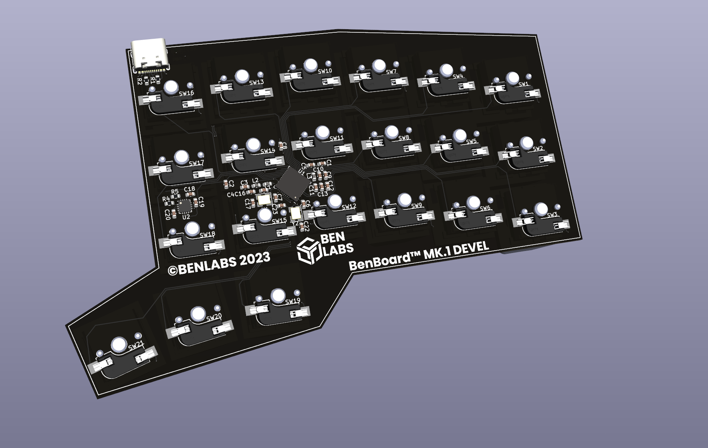

# BenBoard

The highly customisable, open source, premium 42 key ergo mechanical marvel of elegance

Show your interest at https://ben-labs.co.uk

## Features

- Reduced layout 42 key split keyboard
- Cherry MX hotswap compatable (any 3 or 5 pin)
- Fully wireless (BLE)
- Month-long battery life with the low power NRF52840
- Out of the box ZMK Support
- Supports [VIK](https://github.com/sadekbaroudi/vik) (on both sides!)
- Unibody case that has been verified to be CNC'able

## Contribution

[ ] TODO

## VIK Certification

| Category                 | Classification          | Response           |
| -----------------------  | ----------------------- | ------------------ |
| FPC connector            | Required                | :heavy_check_mark: |
| Breakout pins            | Recommended             | :x:                |
| Supplies: SPI            | Required                | :heavy_check_mark: |
| Supplies: I2C            | Required                | :heavy_check_mark: |
| I2C on main PCB          | Discouraged             | :x:                |
| I2C pull ups             | Informative             | 2.2kΩ              |
| Supplies: RGB            | Required                | :heavy_check_mark: |
| Supplies: Extra GPIO 1   | Required                | :heavy_check_mark: (Analogue and Digital) |
| Supplies: Extra GPIO 2   | Required                | :heavy_check_mark: (Analogue and Digital) |

THIS IS A WORK IN PROGRESS, ANY FEATURES LISTED ARE PURELY IN PROGRESS

